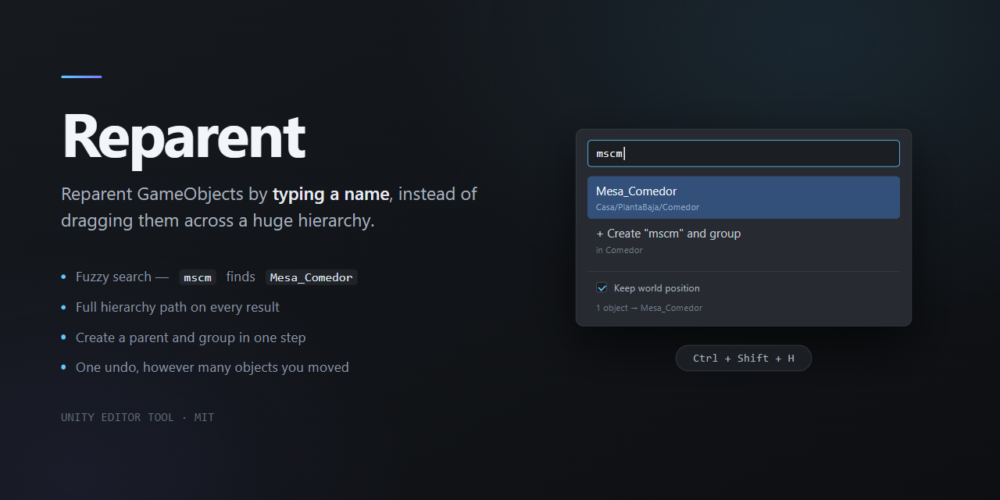

# Reparent

**Reparent GameObjects by typing a name, instead of dragging them across a huge hierarchy.**

Select one or more objects, press a shortcut, type part of the new parent's name, hit `Enter`.



---

## Why

Unity's built-in answer is: `Ctrl+X` on the child → filter the Hierarchy with the search box → right-click the parent → **Paste As Child** → clear the filter.

Four steps, it destroys your hierarchy view, and the object sits in limbo until you remember to paste it.

Reparent is one step and leaves the Hierarchy alone.

## Install

**Package Manager → Add package from git URL:**

```
https://github.com/FrancoLeoneDev/reparent.git
```

**Or manually:** download the repo and drop the folder anywhere under `Assets/`.

Editor-only. No dependencies, no runtime cost, nothing shipped in your build.

## Use

| Entry point | How |
|---|---|
| **Shortcut** | `Ctrl+Shift+H` (`Cmd+Shift+H` on macOS). Rebindable under `Edit > Shortcuts > Reparent`. |
| **Hierarchy** | Right-click → `Set Parent...` or `Unparent`. |
| **Inspector** | The `Parent` row at the top of any GameObject header — 🔍 to pick, ✕ to send it to the scene root. |

In the picker:

- **Type to filter.** Matching is fuzzy — `mscm` finds `Mesa_Comedor`.
- **`↑` `↓`** to move, **`Enter`** to confirm, **`Esc`** to cancel.
- Every result shows its **full hierarchy path**, because in a real scene three objects have similar names and the name alone isn't enough.
- **Keep world position** is on by default. Turn it off to preserve local coordinates instead. The choice is remembered.

### Create and group

Type a name that doesn't exist and the last row offers **`+ Create "X" and group`**.

It creates an empty GameObject as a **sibling of the first selected object** — same parent, same sibling index — centred on the selection, and moves everything into it.

Grouping never relocates anything. If you want the group at the scene root, group first and then use `Unparent`.

## Behaviour

- Searches every object in the selection's scene, **including inactive ones**. Inside Prefab Mode, only the open prefab.
- Objects that would create a cycle — the selection itself and its descendants — are never listed.
- Multi-selection moves only the roots: selecting a parent and its child moves the parent once.
- Unity does not allow parenting across scenes. If your selection spans several scenes the tool says so instead of failing halfway.
- The whole operation collapses into a **single `Undo` step**, however many objects you moved.

## Requirements

**Unity 6000.0 or newer.** The picker uses UI Toolkit's `ListView`, whose current API landed in the 2022 cycle; older versions are not supported.

## Tests

18 EditMode tests covering the fuzzy ranking, cycle exclusion, world/local position handling, single-step undo, and create-and-group placement. Run them from `Window > General > Test Runner`.

## License

MIT — see [LICENSE.md](LICENSE.md).
